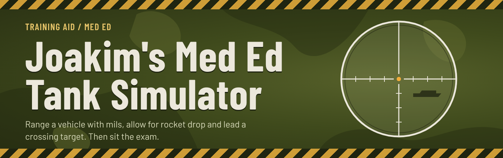
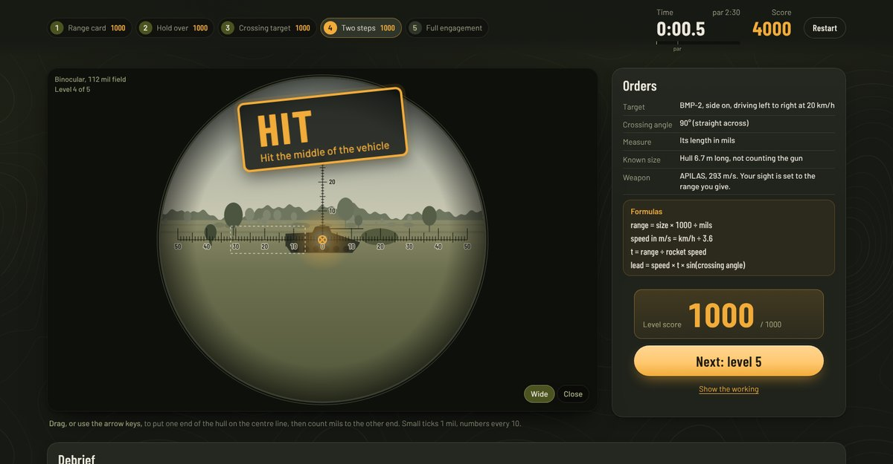
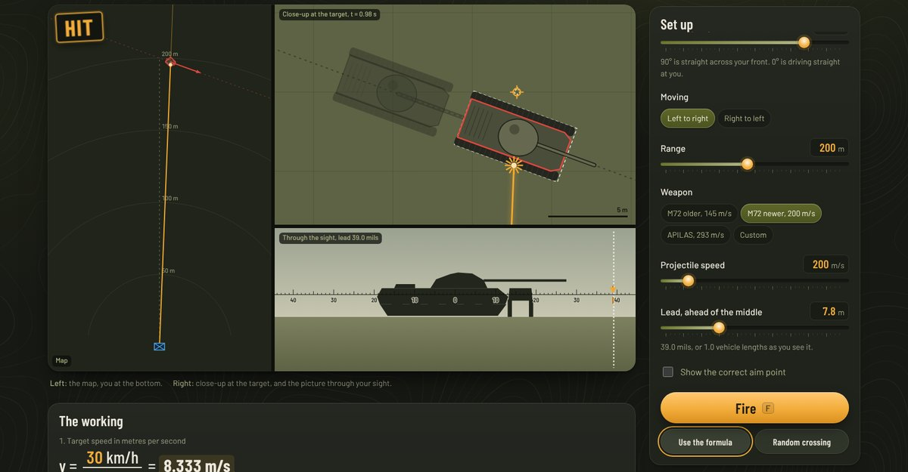

  

  
  
  
  

A browser game that goes with my teaching session on Russian and Soviet armour. You look through a sight, work out how far away a vehicle is, allow for the rocket dropping on the way, and aim ahead of something that is moving. Then you sit a timed exam with pen and paper.

**[Play it here](https://hylcke.github.io/minigame-medical-education-tank-simulator/)**

## Exercises

| | What you learn | The formula |
|---|---|---|
| **1. Mil scale** | Measuring a vehicle in the sight and turning that into a range | range = size × 1000 ÷ mils |
| **2. Projectile drop** | How far a rocket falls when your range guess is wrong | drop grows with range² ÷ speed² |
| **3. Lead** | How far ahead to aim at a vehicle crossing your view | lead = speed × time × sin(angle) |

Each one has sliders to play with and a sight you can fire through, so you can see the effect of a bad estimate straight away.

## The exam

Five levels, each harder than the last, finishing with a full engagement where you range, hold over and lead in one go. Work it out on paper, type your answer and fire.

- **Accuracy** counts most, then **speed**, then whether you actually hit.
- The formulas are on screen, so it tests method rather than memory.
- Grades run from Fresher up to Consultant.
- Every exam has a code. Give the whole room the same code (for example `MEDED`) and everyone gets the same targets, which makes for a fair leaderboard.

## Good to know

- Built for a laptop or desktop screen. A 1080p display is ideal.
- Nothing to install, no accounts and no data leaves your browser.
- The physics is deliberately simplified for teaching. It is not a real fire control tool.

## Credits

Made by Joakim for medical education teaching. Fonts are Barlow and Barlow Condensed by Jeremy Tran, under the SIL Open Font Licence.
